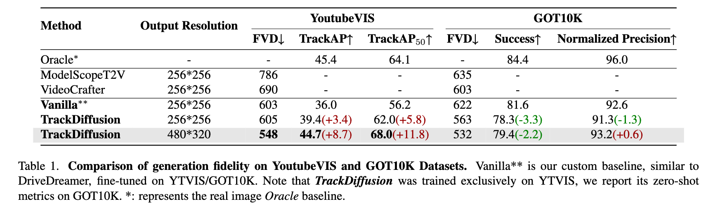

<div align="center">

</div>

## TrackDiffusion: Multi-object Tracking Data Generation via Diffusion Models

Pytorch implementation of [TrackDiffusion: Multi-object Tracking Data Generation via Diffusion Models](https://arxiv.org/abs/2312.00651)

> TrackDiffusion: Multi-object Tracking Data Generation via Diffusion Models <br>
> [Pengxiang Li](https://pixeli99.github.io)<sup>1\*</sup>, [Zhili Liu](https://scholar.google.com/citations?user=FdR09jsAAAAJ&hl=zh-TW)<sup>2\*</sup>, [Kai Chen](https://kaichen1998.github.io/)<sup>2\*</sup>, [Lanqing Hong](https://scholar.google.com.sg/citations?user=2p7x6OUAAAAJ&hl=en)<sup>3</sup>, Yunzhi Zhuge<sup>1</sup>, [Dit-Yan Yeung](https://sites.google.com/view/dyyeung)<sup>2</sup>, [Huchuan Lu](https://scholar.google.com/citations?user=D3nE0agAAAAJ&hl=en)<sup>1</sup>, [Xu Jia](https://stephenjia.github.io/)<sup>1^</sup><br>
> <sup>1</sup>DLUT <sup>2</sup>HKUST <sup>3</sup>Huawei Noah's Ark Lab <br>
> <sup>\*</sup>Equal Contribution <sup>^</sup>Corresponding Authors

[](https://arxiv.org/pdf/2312.00651.pdf)
[](https://kaichen1998.github.io/projects/trackdiffusion/)

## Abstract 

Diffusion models have gained prominence in generating data for perception tasks such as image classification and object detection. However, the potential in generating high-quality tracking sequences, a crucial aspect in the field of video perception, has not been fully investigated. To address this gap, we propose TrackDiffusion, a novel architecture designed to generate continuous video sequences from the tracklets. TrackDiffusion represents a significant departure from the traditional layout-to-image (L2I) generation and copy-paste synthesis focusing on static image elements like bounding boxes by empowering image diffusion models to encompass dynamic and continuous tracking trajectories, thereby capturing complex motion nuances and ensuring instance consistency among video frames. For the first time, we demonstrate that the generated video sequences can be utilized for training multi-object tracking (MOT) systems, leading to significant improvement in tracker performance. Experimental results show that our model significantly enhances instance consistency in generated video sequences, leading to improved perceptual metrics. Our approach achieves an improvement of 8.7 in TrackAP and 11.8 in TrackAP$_{50}$ on the YTVIS dataset, underscoring its potential to redefine the standards of video data generation for MOT tasks and beyond.

## Method

The framework generates video frames based on the provided tracklets and employs the **Instance Enhancer** to reinforce the temporal consistency of foreground instance. A new gated cross-attention layer is inserted to take in the new instance information..


## Training

Coming soon.

## Results

- Compare TrackDiffusion with other methods for generation quality:



- Training support with frames generated from TrackDiffusion:

<div align="center">

</div>

More results can be found in the main paper.

## Visualization

- Challenging Scenarios

Tracklet-to-video generation in the (a) scale variation (b) challenging overlapping and (c) re-occurrence scenarios.


- GOT10K Dataset


- YTVIS Dataset


More results can be found in the main paper and [project page](https://kaichen1998.github.io/projects/trackdiffusion/).

## Cite Us

```bibtex
@article{li2023trackdiffusion,
  title={TrackDiffusion: Multi-object Tracking Data Generation via Diffusion Models},
  author={Li, Pengxiang and Liu Zhili, and Chen, Kai and Hong, Lanqing and Zhuge, Yunzhi and Yeung, Dit-Yan and Lu, Huchuan and Jia, Xu},
  journal={arXiv preprint arXiv:2312.00651},
  year={2023}
}
```