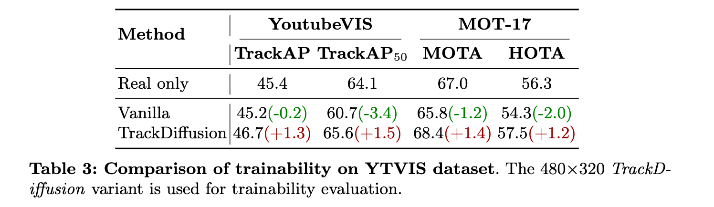

<div align="center">

</div>

## TrackDiffusion: Tracklet-Conditioned Video Generation via Diffusion Models

Pytorch implementation of [TrackDiffusion: Tracklet-Conditioned Video Generation via Diffusion Models](https://arxiv.org/abs/2312.00651)

## Abstract 

Despite remarkable achievements in video synthesis, achieving granular control over complex dynamics, such as nuanced movement among multiple interacting objects, still presents a significant hurdle for dynamic world modeling, compounded by the necessity to manage appearance and disappearance, drastic scale changes, and ensure consistency for instances across frames.
These challenges hinder the development of video generation that can faithfully mimic real-world complexity, limiting utility for applications requiring high-level realism and controllability, including advanced scene simulation and training of perception systems.
To address that, we propose TrackDiffusion, a novel video generation framework affording fine-grained trajectory-conditioned motion control via diffusion models, which facilitates the precise manipulation of the object trajectories and interactions, overcoming the prevalent limitation of scale and continuity disruptions. 
A pivotal component of TrackDiffusion is the instance enhancer, which explicitly ensures inter-frame consistency of multiple objects, a critical factor overlooked in the current literature.
Moreover, we demonstrate that generated video sequences by our TrackDiffusion can be used as training data for visual perception models.
To the best of our knowledge, this is the first work to apply video diffusion models with tracklet conditions and demonstrate that generated frames can be beneficial for improving the performance of object trackers.

## Method

The framework generates video frames based on the provided tracklets and employs the **Instance Enhancer** to reinforce the temporal consistency of foreground instance. A new gated cross-attention layer is inserted to take in the new instance information.


## Getting Started

### Environment Setup
The code is tested with Pytorch==2.0.1 and cuda 11.8 on A800 servers. To setup the python environment, follow:
```bash
cd ${ROOT}
pip install -r requirements.txt
```
Then, continue to install `third_party` requirements, follow:
#### Install MMTracking
```bash
pip install https://download.openmmlab.com/mmcv/dist/cu117/torch2.0.0/mmcv-2.0.0-cp310-cp310-manylinux1_x86_64.whl

git clone https://github.com/open-mmlab/mmtracking.git -b dev-1.x

cd mmtracking
pip install -e .
```

#### Install Diffusers
```bash
cd third_party/diffusers
pip install -e .
```

### Dataset
Please download the datasets from the official websites.
[YouTube-VIS 2021](https://youtube-vos.org/dataset/vis/)

We also provide the text caption files for the ytvis dataset, please download from [Google Drive](https://drive.google.com/file/d/1dz_H6xkzgPJC5Jstqy6BKDrKqZ_nuU5Y/view?usp=sharing).

### Pretrained Weights

| T2V Version | Stable Video Diffusion Version |
|:------------------:|:------------------------------:|
| Our training are based on `pengxiang/GLIGEN_1_4`. You can access the following links to obtain the trained weights:<br><br>[weight](https://huggingface.co/pengxiang/TrackDiffusion_ModelScope)         | Our training are based on `stabilityai/stable-video-diffusion-img2vid`. You can access the following links to obtain weights for stage 1 and 2:<br>[Stage1](https://huggingface.co/pengxiang/TrackDiffusion_SVD_Stage1)<br>[Stage2](https://huggingface.co/pengxiang/TrackDiffusion_SVD_Stage2) |


## Training

### 1. Convert Annotations

We use CocoVID to maintain all datasets in this codebase. In this case, you need to convert the official annotations to this style. We provide scripts and the usages are as following:

```python
cd ./third_party/mmtracking
python ./tools/dataset_converters/youtubevis/youtubevis2coco.py -i ./data/youtube_vis_2021 -o ./data/youtube_vis_2021/annotations --version 2021
```
The folder structure will be as following after your run these scripts:
```
├── data
│   ├── youtube_vis_2021
│   │   │── train
│   │   │   │── JPEGImages
│   │   │   │── instances.json (the official annotation files)
│   │   │   │── ......
│   │   │── valid
│   │   │   │── JPEGImages
│   │   │   │── instances.json (the official annotation files)
│   │   │   │── ......
│   │   │── test
│   │   │   │── JPEGImages
│   │   │   │── instances.json (the official annotation files)
│   │   │   │── ......
│   │   │── annotations (the converted annotation file)
```

### 2. For T2V Training

Launch training with (with 8xA800):

If you encounter an error similar to `AssertionError: MMEngine==0.10.3 is used but incompatible. Please install mmengine>=0.0.0, <0.2.0.`, please directly jump to that line of code and comment it out.
```bash
bash ./scripts/t2v.sh
```

### 3. For I2V Training (WIP)

✨**If you want SVD version, please find the code at the [SVD branch](https://github.com/pixeli99/TrackDiffusion/tree/SVD).**

## Inference

Check `demo.ipynb` for more details.

## Results

- Compare TrackDiffusion with other methods for generation quality:


- Training support with frames generated from TrackDiffusion:

<div align="center">

</div>

More results can be found in the main paper.

## The GeoDiffusion Family

We aim to construct a controllable and flexible pipeline for perception data corner case generation and visual world modeling! Check our latest works:

- [GeoDiffusion](https://kaichen1998.github.io/projects/geodiffusion/): text-prompted geometric controls for 2D object detection.
- [MagicDrive](https://gaoruiyuan.com/magicdrive/): multi-view street scene generation for 3D object detection.
- [TrackDiffusion](https://kaichen1998.github.io/projects/trackdiffusion/): multi-object video generation for MOT tracking.
- [DetDiffusion](https://arxiv.org/abs/2403.13304): customized corner case generation.
- [Geom-Erasing](https://arxiv.org/abs/2310.05873): geometric controls for implicit concept removal.

## Cite Us

```bibtex
@misc{li2024trackdiffusion,
      title={TrackDiffusion: Tracklet-Conditioned Video Generation via Diffusion Models}, 
      author={Pengxiang Li and Kai Chen and Zhili Liu and Ruiyuan Gao and Lanqing Hong and Guo Zhou and Hua Yao and Dit-Yan Yeung and Huchuan Lu and Xu Jia},
      year={2024},
      eprint={2312.00651},
      archivePrefix={arXiv},
      primaryClass={cs.CV}
}
```
